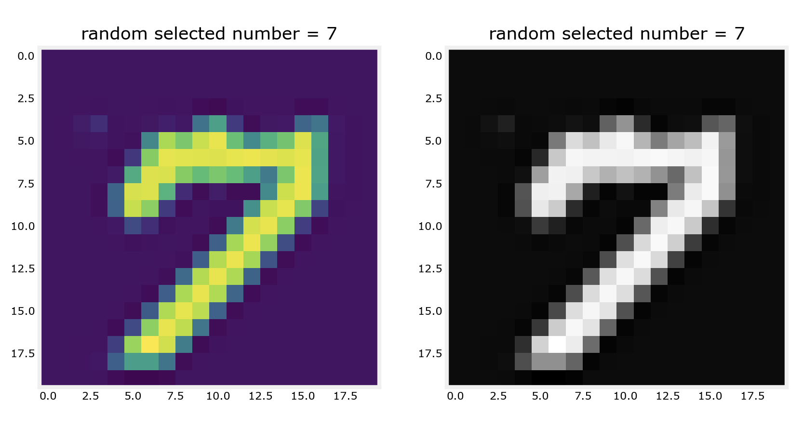
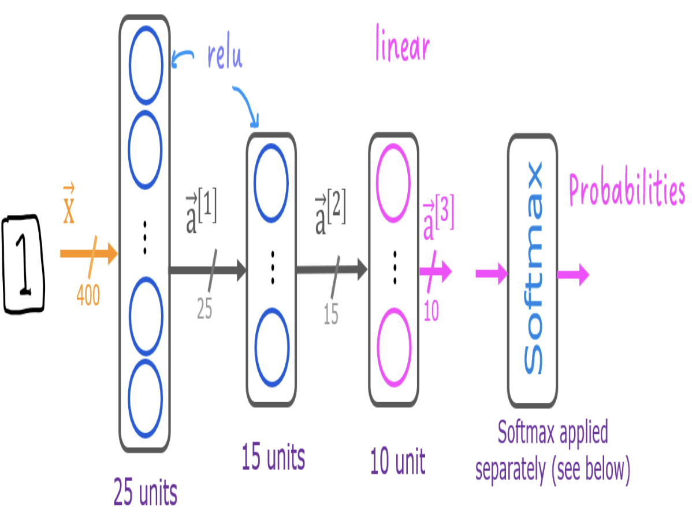
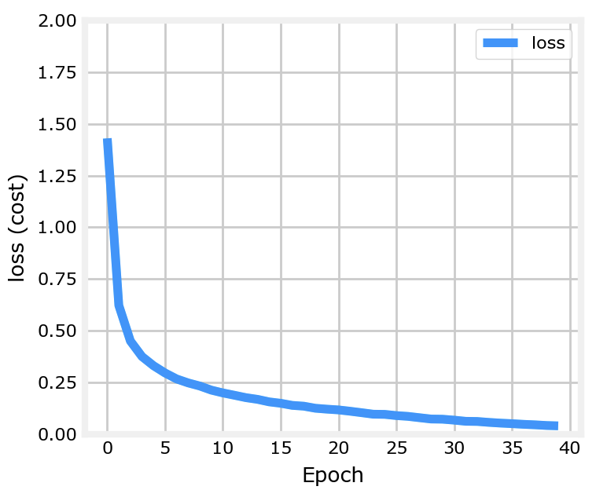
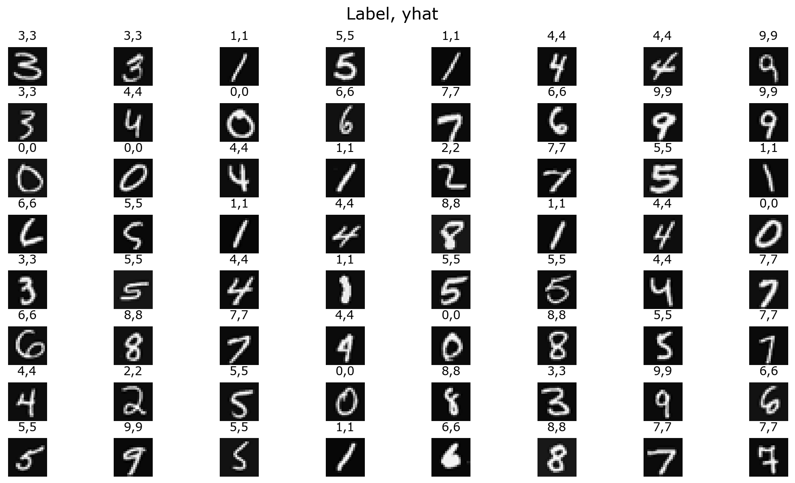

# Handwritten Digit Recognition: 0-9

In this project, you will develop a neural network to recognize ten handwritten digits, 0-9. This is a multiclass classification task where one of ten possible digits is selected as the output. Automated handwritten digit recognition is widely used today, from recognizing zip codes (postal codes) on mail envelopes to recognizing amounts written on bank checks.

## Data Set

The dataset used is the MNIST dataset, which contains a large collection of handwritten digits (0-9). MNIST is one of the most famous datasets in machine learning and computer vision, frequently used for training various image processing systems.

<p align="center">
  
</p>

## Model Representation

The neural network used in this project consists of multiple dense layers with activation functions suitable for multiclass classification. Here are some key details:

- The input layer receives pixel values from digit images.
- Each image is of size \(20 \times 20\), resulting in 400 input features.
- The output layer has 10 neurons, one for each digit class (0-9), with a softmax activation function.

<p align="center">
  
</p>

The model's architecture includes:
- **Input layer**: 25 neurons (one for each pixel).
- **Hidden layers**: (number of neurons and specifics).
- **Output layer**: 10 neurons (for multiclass classification).

## Learning Curve

The learning curve below shows the model's training and validation accuracy (or loss) over time. It helps visualize how well the model is learning and whether it might be overfitting or underfitting.

<p align="center">
  
</p>

## Implementation Details

We will see predictions model:

<p align="center">
  
</p>

## Usage

To run the project locally, follow these steps:

1. Clone the repository:
   ```bash
   git clone https://github.com/yourusername/handwritten-digit-recognition.git

## License

This project is licensed under the MIT License - see the [LICENSE](LICENSE) file for details.

## Acknowledgments

- Special thanks to the contributors and developers of the tools and libraries used in this project.
